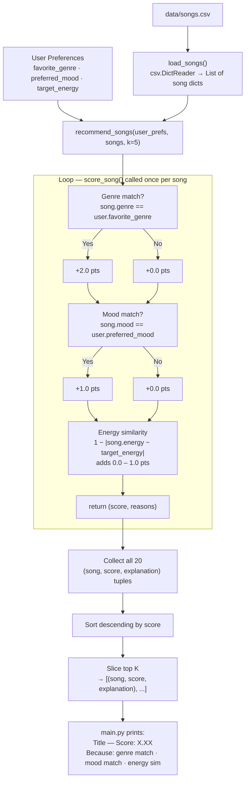

# Data Flow Diagram

This diagram traces how a single song moves from `data/songs.csv` through the
scoring pipeline to a ranked recommendation list.

Render this diagram in any Mermaid-compatible viewer — VS Code preview,
the [Mermaid Live Editor](https://mermaid.live), or GitHub (which renders
Mermaid fences natively in Markdown files).

